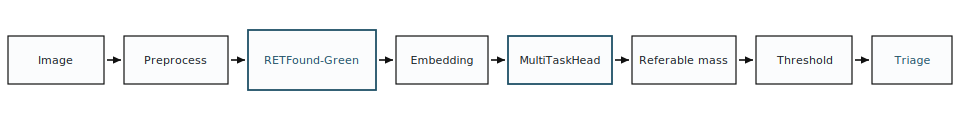

<h1 align="center">FROST</h1>
<p align="center"><strong>Frozen Representations for Ocular Screening and Triage</strong></p>

<p align="center">
A self-contained inference service that serves a frozen ~22M-parameter vision model
end-to-end on commodity CPU — and <em>refuses to start</em> unless it can prove, at boot,
that it reproduces the reference model bit-for-bit.
</p>

<p align="center">
  <a href="https://nikunj985-frost-referable-dr.hf.space"><strong>▶ Live demo</strong></a> &nbsp;·&nbsp;
  <a href="#quickstart">Run locally</a> &nbsp;·&nbsp;
  <a href="#how-it-works">How it works</a> &nbsp;·&nbsp;
  <a href="deploy/referable_dr_demo/hf_space/DEPLOY.md">Deploy</a>
</p>

<p align="center">
  
  
  
  
  
</p>

---

## TL;DR — why this is worth a look

FROST takes one uploaded retinal photograph and returns a screening decision **plus a
complete, step-by-step trace of how it got there** — in well under a second, on a free CPU
container, with no GPU anywhere. The interesting part isn't the model; it's the engineering
around it:

- **Reproducibility enforced at runtime, not asserted in a README.** On boot the service
  computes the model output two independent ways and **refuses to serve** unless they agree
  to ≤ 1e-5 (measured: `0.0`). A separate pre-deploy gate proves the served scores match the
  study's saved predictions to < 1e-4 (measured: `5e-10`).
- **Provenance-bound decisions.** The decision threshold is cryptographically bound (SHA-256)
  to the exact backbone **+** head **+** preprocessing **+** task ordering it was derived from.
  Any drift → `HTTP 503`. The service will emit a *correct* number or *no* number — never a
  wrong one.
- **One container, CPU-only, GPU-free.** FastAPI serves both the API and the static UI from a
  single origin (so: zero CORS config). The 84 MB public backbone is fetched and SHA-verified
  at image-build time; the 501 KB trained head rides inside the image. **No credentialed data
  is anywhere in the deployable artifact.**
- **Glass-box by default.** Every request returns the full pipeline trace — preprocessing →
  frozen backbone → embedding → head → score → threshold → decision — rendered live in the UI.
- **Privacy by construction.** Uploads are processed in memory and discarded per request. No
  storage, no accounts, no identifiers logged.
- **Strict isolation + tested.** The entire app lives under `deploy/referable_dr_demo/` and
  imports the research code as a **read-only** library — it never mutates a single pipeline
  file. 26 app-local tests cover parity, privacy, "no-training-imports," threshold provenance,
  and the load-once singleton.

**→ [Open the live demo](https://nikunj985-frost-referable-dr.hf.space)** and upload any colour
fundus image to see the decision and the trace.

---

## Screenshots

<p align="center"></p>

<!--
  Add three PNGs to docs/img/ (see docs/img/README.md), then uncomment this block:

  <p align="center"></p>
  <p align="center"></p>
  <p align="center"></p>
-->

> The three tool screenshots aren't committed yet — drop `frost-home.png`,
> `frost-triage.png`, `frost-report.png` into [`docs/img/`](docs/img/) and uncomment the block
> above. Until then, the **[live demo](https://nikunj985-frost-referable-dr.hf.space)** is the
> best way to see the interface.

---

## What it does

Upload a retinal fundus photograph → FROST runs a fixed, frozen model pipeline and returns a
binary **triage decision** with a numeric score, a threshold gauge, and a per-stage trace.

The model is never trained or updated at request time. It is a **frozen** feature extractor
(`RETFound-Green`, a ViT-Small/14 at its native 392×392 resolution, average-pooled to a
384-dimensional embedding) feeding a small **multi-task prediction head**. The head emits
5-class grade logits; the screening score is the softmax mass on the upper classes; a single
threshold fixed on a held-out validation split turns that score into the decision. That's it —
deliberately small, fast, and reproducible.

> FROST is a **research demonstrator**, not a medical device, and is validated only on one
> dataset's internal distribution. The UI states this prominently.

---

## <a id="how-it-works"></a>How it works

### Request lifecycle
```
POST /predict (multipart image, in-memory)
  → technical input checks (decode, size, format — never stored)
  → native-392 preprocessing        (exact study transform, hash-verified)
  → frozen backbone  → 384-d embedding
  → multi-task head  → 5-class logits
  → softmax → screening score (mass on upper grades)
  → fixed validation-derived threshold → decision
  → JSON: decision + score + threshold + full pipeline_trace + timings
```
The frontend (vanilla HTML/CSS/JS, no framework, no build step) is served by the **same**
FastAPI app and renders that `pipeline_trace` as the visible "analysis report."

### The parity gate (the part that makes it trustworthy)
The service does not re-implement the model — it imports the study's own loader,
preprocessing, and scoring functions from `src/retina_screen/` as read-only libraries, then
proves equivalence before going live:

- **Synthetic parity (runs on every boot):** the app's inference path is compared against an
  independent, inline reconstruction built from the same primitives. Max abs logit diff must
  be ≤ 1e-5. If it fails, the server comes up **blocked** and `/predict` returns `503`.
- **Study-linked parity (local pre-deploy gate):** the app's scores are compared against the
  study's saved `predictions.npz` on real held-out images; abs diff must be < 1e-4. This runs
  on the author's machine (the data is credentialed) and is the sign-off before any deploy.
- **On the server**, where credentialed images are absent by design, the boot self-check is
  synthetic-parity **plus** a random-tensor integrity check (finite, in-range, correct shapes)
  — no real image ever required.

### Provenance binding
A validated "deployment bundle" records SHA-256 hashes of the backbone checkpoint, the head
checkpoint, the preprocessing config, and the task ordering. The operating-point threshold is
refused unless every one of those still matches. Change any artifact and the service fails
closed rather than silently serving a threshold that no longer applies.

### Load-once singleton
The backbone + head are constructed **once** per process at startup (`eval`, `no_grad`,
frozen, warm-up pass), then reused for every request — no per-request model loading, no
gradient graph ever built.

---

## Tech stack

- **Serving:** Python 3.12, FastAPI + Uvicorn, single-origin static frontend (no CORS).
- **Model:** PyTorch 2.12 (CPU wheels), `timm` 1.0.27 (`vit_small_patch14_reg4_dinov2`).
- **Frontend:** hand-written HTML/CSS/JS — no framework, no bundler, no CDN.
- **Packaging/deploy:** Docker (one image), Hugging Face **Docker Space**, free CPU tier.
  Backbone fetched + SHA-verified at build; head + operating point travel in-image.
- **Reproducibility:** module-level singleton, fail-closed parity + provenance gates,
  pinned dependency set.

---

## <a id="quickstart"></a>Quickstart (run locally)

Prereqs: the frozen backbone checkpoint and the trained head checkpoint on disk (paths are
resolved from env vars — nothing private is hardcoded). Then:

```bash
# 1. build the local deployment bundle (hashes + shape/pooling/size gates)
python deploy/referable_dr_demo/analysis/build_local_deployment_bundle.py

# 2. derive the validation-only operating-point threshold
python deploy/referable_dr_demo/analysis/derive_threshold.py

# 3. prove parity (synthetic + study-linked) — must print PASS
python deploy/referable_dr_demo/analysis/verify_parity.py

# 4. launch (serves API + UI at http://127.0.0.1:8000)
uvicorn deploy.referable_dr_demo.backend.app:app --host 127.0.0.1 --port 8000
```

App-local tests:
```bash
pytest deploy/referable_dr_demo/tests -q
```

Full setup notes live in [`deploy/referable_dr_demo/README.md`](deploy/referable_dr_demo/README.md).

## Deploy (free, persistent, CPU)

One command stages a ready-to-push Hugging Face Docker Space (code + head + operating point,
no credentialed data); the backbone is fetched at build. Full runbook:
**[`deploy/referable_dr_demo/hf_space/DEPLOY.md`](deploy/referable_dr_demo/hf_space/DEPLOY.md)**.

---

## Repository layout

The tool is fully contained under `deploy/referable_dr_demo/`; the rest of the repo is the
research pipeline it reproduces.

```
deploy/referable_dr_demo/
├── backend/            FastAPI app, response schemas, static serving
│   └── service/        bundle validation · frozen inference · preprocessing parity
│                       · threshold policy · provenance/hashing · privacy
├── frontend/           vanilla HTML/CSS/JS UI + pipeline diagram
├── analysis/           bundle build · threshold derivation · parity gate
├── hf_space/           Dockerfile · assemble_space.py · deploy runbook
└── tests/              26 app-local tests

src/retina_screen/      the research pipeline (imported READ-ONLY by the tool)
configs/                backbone / preprocessing / task YAMLs
docs/                   project docs and this README's images
```

---

## The research behind it

FROST is the deployable artifact of a controlled study that compares **frozen** foundation-model
representations (supervised CNNs, general self-supervised ViTs, and a retina-specific model) for
retinal screening under one fixed, patient-level protocol with bootstrap confidence intervals.
The headline engineering choice — a **22M-parameter** frozen backbone instead of a ~300M one —
is grounded in that comparison: the small retina-specific model was statistically **not
separable** from models ~14× its size on the target endpoint, so FROST deploys the efficient
one on purpose.

The full methodology, results, and figures are in the manuscript (`paper/`). This README is
intentionally about the **tool**; the comparison lives in the paper.

---

## Attribution, license & data

- **Backbone:** RETFound-Green — public weights under **Apache-2.0**; fetched from its official
  release and SHA-verified at build.
- **Prediction head:** trained in this work; freely redistributable.
- **Dataset:** BRSET, available on PhysioNet under **credentialed access**. No dataset images
  are stored in this repo, in the Docker image, or in the hosted Space.
- **Repository license:** to be finalized before public release.
